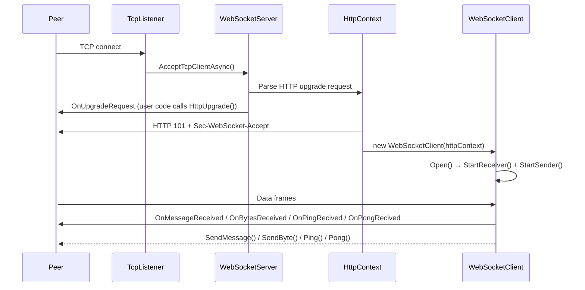

# LHZ.WebSocket

[中文](README.zh-CN.md)

A lightweight, zero-dependency WebSocket library for .NET, implementing RFC 6455 from the ground up using raw `TcpListener` / `TcpClient`. Supports both server-side and client-side WebSocket connections.

## Features

- **Zero dependencies** — pure .NET, no third-party libraries
- **RFC 6455 compliant** — FIN, RSV1–3, all opcodes, masking, extended payload lengths
- **Server & Client** — create WebSocket servers or connect as a client via `CreateWebSocketClient`
- **Fragmented messages** — automatic reassembly of continuation frames (client → server)
- **Streaming send** — split large payloads across multiple frames via `CreateDataFrame(Stream)`
- **Bounded channel** — producer-consumer pattern for outgoing frames; no unbounded queues
- **Event-driven** — `OnMessageReceived`, `OnBytesReceived`, `OnCloseRecived`, `OnClientClose`, `OnPingRecived`, `OnPongRecived`
- **Multi-targeting** — `net5.0`, `net6.0`, `net8.0`, `net9.0`, `net10.0` with nullable reference types enabled
- **Handshake timeout** — configurable timeout to reject slow HTTP upgrade requests
- **xUnit tested** — comprehensive unit tests for frame parsing, close messages, HTTP headers, server, and client

## Quick Start

### 1. Add `LHZ.WebSocket` Package

#### Package Manager

``` bash
Install-Package LHZ.WebSocket -version 1.0.2
```

#### .NET CLI

``` bash
dotnet add package LHZ.WebSocket --Version 1.0.2
```

#### Package Reference

``` xml
<PackageReference Include="LHZ.WebSocket" Version="1.0.2" />
```

### 2. Create and start a server

```csharp
using LHZ.WebSocket;
using LHZ.WebSocket.Core;
using LHZ.WebSocket.Http;
using LHZ.WebSocket.Interfaces;

// Listen on port 5000, all interfaces
var server = new WebSocketServer(5000);

server.OnUpgradeRequest += (HttpContext context) =>
{
    // Optional: inspect headers, add custom response headers, or deny the upgrade
    // context.Response?.Headers.Add("X-Custom", "value");

    var client = context.HttpUpgrade();    // completes the 101 handshake

    client.OnMessageReceived += (IWebSocketClient sender, string message) =>
    {
        Console.WriteLine($"Received: {message}");
        sender.SendMessage($"Echo: {message}");
    };

    client.OnBytesReceived += (IWebSocketClient sender, byte[] data) =>
    {
        Console.WriteLine($"Received {data.Length} bytes");
    };

    client.OnCloseRecived += (IWebSocketClient sender, CloseMessage msg) =>
    {
        Console.WriteLine($"Client closed: {msg.CloseCode} — {msg.Message}");
        sender.Close();
    };
};

server.Start();
Console.WriteLine($"Server started, {server.ClientNums} clients connected");
Console.ReadLine();
server.Stop();
```

### 3. Connect as a client

```csharp
using LHZ.WebSocket;
using LHZ.WebSocket.Core;
using LHZ.WebSocket.Interfaces;

// Connect to a WebSocket server
var client = WebSocketClient.CreateWebSocketClient("ws://localhost:5000/");

client.OnMessageReceived += (IWebSocketClient sender, string message) =>
{
    Console.WriteLine($"Received: {message}");
};

client.OnCloseRecived += (IWebSocketClient sender, CloseMessage message) =>
{
    Console.WriteLine($"Connection closed: {message.CloseCode}");
    sender.Close();
};

client.Open();
client.SendMessage("Hello World!");
```

### 4. Bind to a specific IP

```csharp
var server = new WebSocketServer(IPAddress.Loopback, 5000);
```

### 5. Try the browser demo

Open `chat-client.html` in a browser, or run the unit tests:

```bash
cd src
dotnet test
```

## API Reference

### `WebSocketServer`

| Member | Description |
|--------|-------------|
| `WebSocketServer(int port)` | Bind to all interfaces on the given port |
| `WebSocketServer(IPAddress ip, int port)` | Bind to a specific IP and port |
| `WebSocketServer(IPAddress ip, int port, int timeOut)` | Bind to a specific IP and port with a handshake timeout (seconds) |
| `Start()` | Begin accepting connections |
| `Stop()` | Disconnect all clients and stop listening |
| `ClientNums` | Current number of connected clients |
| `WebSocketClients` | Snapshot of connected clients (`IEnumerable<IWebSocketClient>`) |
| `OnUpgradeRequest` | Fired when an HTTP upgrade is received; call `HttpUpgrade()` to accept |
| `OnClientConnected` | Fired after the WebSocket handshake completes (`Action<IWebSocketClient>`) |

### `IWebSocketClient` (interface)

| Member | Description |
|--------|-------------|
| `ID` | Unique `Guid` for this connection |
| `Status` | Current `ClientStatus` (Connection / Opend / Close) |
| `SendMessage(string)` | Send a UTF-8 text frame |
| `SendByte(byte[])` | Send a binary frame |
| `Ping(byte[])` | Send a Ping frame |
| `Pong(byte[])` | Send a Pong frame |
| `Open()` | Start the background send/receive loops |
| `Close()` | Cancel tasks and dispose the TCP connection |
| `Dispose()` | Alias for `Close()` (implements `IDisposable`) |
| `OnMessageReceived` | `EventHandler<IWebSocketClient, string>` — complete text message |
| `OnBytesReceived` | `EventHandler<IWebSocketClient, byte[]>` — complete binary message |
| `OnCloseRecived` | `EventHandler<IWebSocketClient, CloseMessage>` — close frame received |
| `OnPingRecived` | `EventHandler<IWebSocketClient, byte[]>` — Ping frame received |
| `OnPongRecived` | `EventHandler<IWebSocketClient, byte[]>` — Pong frame received |
| `OnClientClose` | `Action<IWebSocketClient>` — connection closed (local or remote) |

### `WebSocketClient`

| Member | Description |
|--------|-------------|
| `CreateWebSocketClient(string url, HttpHeaders? headers)` | **Static** — creates a client connection to a WebSocket server |
| `HttpContext` | The underlying HTTP context for this connection |
| `Status` | Current `ClientStatus` |
| `SendMessage(string)` | Send a UTF-8 text frame |
| `SendByte(byte[])` | Send a binary frame |
| `Ping(byte[])` | Send a Ping frame |
| `Pong(byte[])` | Send a Pong frame |
| `Open()` | Start background send/receive loops |
| `Close()` | Cancel tasks and dispose the TCP connection |
| `Dispose()` | Alias for `Close()` |

### `IHttpContext` (interface)

| Member | Description |
|--------|-------------|
| `Request` | Parsed HTTP request (method, URL, headers) |
| `Response` | HTTP response object |
| `Stream` | The underlying network stream |
| `Status` | Current `HttpContextStatus` |
| `HttpUpgrade(int capacity = 1024)` | Completes the WebSocket handshake and returns the `WebSocketClient` |

### `HttpContextBase` (abstract class)

Base class implementing `IHttpContext`. Provides HTTP request parsing, timeout handling, and the `HttpUpgrade()` handshake logic. The concrete `HttpContext` class adds `TcpClient` support.

### `HttpContext` (sealed, extends `HttpContextBase`)

| Member | Description |
|--------|-------------|
| `Request` | Parsed HTTP request (method, URL, headers) |
| `Response` | HTTP response object (nullable; populated for server-side upgrades) |
| `TcpClient` | The underlying TCP connection |
| `Stream` | The underlying network stream |
| `Status` | Current `HttpContextStatus` (NotInitialized / Initialized / Upgraded / TimedOut / Rejected) |
| `HttpUpgrade(int capacity = 1024)` | Computes `Sec-WebSocket-Accept`, writes `101 Switching Protocols`, returns the `WebSocketClient` |
| `WebSocketClient` | The upgraded client (populated after `HttpUpgrade()`) |
| `Dispose()` | Disposes the TCP client if no upgrade was performed |

### `HttpRequest`

| Member | Description |
|--------|-------------|
| `Method` | HTTP method (e.g. `GET`) |
| `Url` | Request path (e.g. `/chat`) |
| `HttpVersion` | HTTP version string (e.g. `HTTP/1.1`) |
| `Headers` | Parsed request headers (`System.Net.Http.Headers.HttpHeaders`, case-insensitive keys) |
| `WriteToStream(Stream)` | Writes the request line and headers to a stream (used for client-side handshake) |

### `HttpResponse`

| Member | Description |
|--------|-------------|
| `StatusCode` | HTTP status code (e.g. `HttpStatusCode.SwitchingProtocols`) |
| `HttpVersion` | HTTP version string (e.g. `HTTP/1.1`) |
| `Headers` | Response headers (`System.Net.Http.Headers.HttpHeaders`) |

### `DataFrame`

| Member | Description |
|--------|-------------|
| `CreateDataFrame(OpCode, bool FIN, byte[]? key, byte[] data)` | Build a single frame from a byte array |
| `CreateDataFrame(OpCode, byte[]? key, Stream data, int maxLen)` | Split a stream into multiple frames |
| `FIN` / `RSV1` / `RSV2` / `RSV3` | Frame control flags |
| `Opcode` | `OpCode` enum value |
| `Masked` | Whether the payload is XOR-masked |
| `MaskingKey` | 4-byte masking key (null if unmasked) |
| `DataFrameHeader` | Serialized frame header (2–14 bytes) |
| `Data` | Payload as `ArraySegment<byte>` |

### `CloseMessage`

| Member | Description |
|--------|-------------|
| `CloseCode` | RFC 6455 status code (e.g. `Normal = 1000`) |
| `Message` | Optional human-readable reason |

### Delegates

**`EventHandler<TSender, TEventArgs>`** — Custom delegate defined in `LHZ.WebSocket.Delegates`

```csharp
public delegate void EventHandler<in TSender, TEventArgs>(TSender sender, TEventArgs e);
```

### Enums

**`OpCode`** — `Continuation (0x0)`, `Text (0x1)`, `Binary (0x2)`, `Close (0x8)`, `Ping (0x9)`, `Pong (0xA)`

**`CloseCode`** — All RFC 6455 codes: `Normal (1000)`, `GoingAway (1001)`, `ProtocolError (1002)`, …, `TlsHandshake (1015)`

**`ClientStatus`** — `Connection`, `Opend`, `Close`

**`ServerStatus`** — `Ready`, `Start`, `Closing`, `Closed`

**`HttpContextStatus`** — `NotInitialized (0)`, `Initialized (1)`, `Upgraded (2)`, `TimedOut (-2)`, `Rejected (-1)`

## Architecture



Internally, each `WebSocketClient` runs two background tasks:

- **Receiver** — reads frames via `DataFrameReader`, reassembles fragmented messages, dispatches by opcode
- **Sender** — dequeues frames from a bounded `Channel<DataFrame>`, writes header + payload to the network stream

## Project Structure

```
LHZ.WebSocket/
├── src/
│   ├── LHZ.WebSocket/                    # Core library
│   │   ├── WebSocketServer.cs           # TCP listener & client lifecycle
│   │   ├── WebSocketClient.cs           # Per-connection send/receive (server & client)
│   │   ├── Core/
│   │   │   ├── CloseMessage.cs          # Close frame payload
│   │   │   ├── DataFrame.cs             # Frame builder / parser (RFC 6455 §5.2)
│   │   │   └── DataFrameReader.cs       # Frame reader from Stream
│   │   ├── Delegates/
│   │   │   └── EventHandler.cs          # Custom event delegate with `in` modifier
│   │   ├── Enums/
│   │   │   ├── ClientStatus.cs          # Client lifecycle states
│   │   │   ├── CloseCode.cs             # RFC 6455 close status codes
│   │   │   ├── HttpContextStatus.cs     # HTTP context lifecycle states
│   │   │   ├── OpCode.cs                # Frame opcodes
│   │   │   └── ServerStatus.cs          # Server lifecycle states
│   │   ├── Http/
│   │   │   ├── HttpContext.cs           # HTTP upgrade handshake (server & client)
│   │   │   ├── HttpContextBase.cs       # Abstract base with handshake & timeout logic
│   │   │   ├── HttpHeaders.cs           # Internal header collection
│   │   │   ├── HttpRequest.cs           # HTTP request-line & header parser/writer
│   │   │   └── HttpResponse.cs          # HTTP response builder & parser
│   │   └── Interfaces/
│   │       ├── IHttpContext.cs          # HTTP context interface
│   │       └── IWebSocketClient.cs      # WebSocket client interface
│   ├── LHZ.WebSocket.Test/              # xUnit test project
│   │   ├── WebSocketServerTests.cs
│   │   ├── WebSocketClientTests.cs
│   │   └── Core/ / Http/
│   └── LHZ.WebSocket.slnx              # Solution file
├── chat-client.html                     # Browser-based multi-user chat demo
├── test-client.html                     # Browser-based test client
├── LICENSE
├── README.md
└── README.zh-CN.md
```

## Requirements

- [.NET 5 / 6 / 8 / 9 / 10 SDK](https://dotnet.microsoft.com/download)

## License

[MIT](LICENSE)


