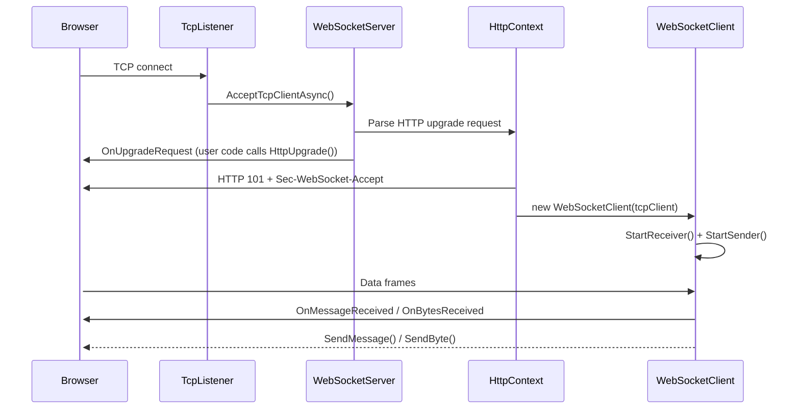

# LHZ.WebSocket.Server

[中文](README.zh-CN.md)

A lightweight, zero-dependency WebSocket server library for .NET, implementing RFC 6455 from the ground up using raw `TcpListener` / `TcpClient`.

## Project Structure

```
LHZ.WebSocket.Server/
├── LHZ.WebSocket.Server/              # Core library
│   ├── WebSocketServer.cs             # TCP listener & client lifecycle
│   ├── WebSocketClient.cs             # Per-connection send/receive
│   ├── Core/
│   │   ├── CloseMessage.cs            # Close frame payload
│   │   ├── DataFrame.cs               # Frame builder / parser (RFC 6455 §5.2)
│   │   └── DataFrameReader.cs         # Frame reader from Stream
│   ├── Enums/
│   │   ├── ClientStatus.cs            # Client lifecycle states
│   │   ├── CloseCode.cs               # RFC 6455 close status codes
│   │   ├── OpCode.cs                  # Frame opcodes
│   │   └── ServerStatus.cs            # Server lifecycle states
│   └── Http/
│       ├── HttpContext.cs             # HTTP upgrade handshake
│       ├── HttpHeaders.cs             # Internal header collection
│       └── HttpRequest.cs             # HTTP request-line & header parser
├── LHZ.WebSocket.TestConsole/         # Echo-server demo
│   └── Program.cs
└── test-client.html                   # Browser-based test client
```

## Features

- **Zero dependencies** — pure .NET, no third-party libraries
- **RFC 6455 compliant** — FIN, RSV1–3, all opcodes, masking, extended payload lengths
- **Fragmented messages** — automatic reassembly of continuation frames (client → server)
- **Streaming send** — split large payloads across multiple frames via `CreateDataFrame(Stream)`
- **Bounded channel** — producer-consumer pattern for outgoing frames; no unbounded queues
- **Event-driven** — `OnMessageReceived`, `OnBytesReceived`, `OnCloseRecived`, `OnClientClose`
- **Ping/pong extensible** — virtual `PingProcessing` / `PongProcessing` for custom keep-alive
- **.NET 10** — targets `net10.0` with nullable reference types enabled

## Quick Start

### 1. Add a project reference

```xml
<ItemGroup>
    <ProjectReference Include="..\LHZ.WebSocket.Server\LHZ.WebSocket.Server.csproj" />
</ItemGroup>
```

### 2. Create and start a server

```csharp
using LHZ.WebSocket.Server;
using LHZ.WebSocket.Server.Core;
using LHZ.WebSocket.Server.Http;

// Listen on port 5000, all interfaces
var server = new WebSocketServer(5000);

server.OnUpgradeRequest += (HttpContext context) =>
{
    // Optional: inspect headers, add custom response headers, or deny the upgrade
    // context.ResponseHeaders.Add("X-Custom", "value");

    var client = context.HttpUpgrade();    // completes the 101 handshake

    client.OnMessageReceived += (WebSocketClient sender, string message) =>
    {
        Console.WriteLine($"Received: {message}");
        sender.SendMessage($"Echo: {message}");
    };

    client.OnBytesReceived += (WebSocketClient sender, byte[] data) =>
    {
        Console.WriteLine($"Received {data.Length} bytes");
    };

    client.OnCloseRecived += (WebSocketClient sender, CloseMessage msg) =>
    {
        Console.WriteLine($"Client closed: {msg.CloseCode} — {msg.Message}");
        sender.Close();
    };
};

server.Start();
Console.WriteLine($"Server started, {server.ClientNums} clients connected");
Console.ReadLine();
server.Stop();
```

### 3. Bind to a specific IP

```csharp
var server = new WebSocketServer(IPAddress.Loopback, 5000);
```

### 4. Run the demo

```bash
cd src/LHZ.WebSocket.TestConsole
dotnet run
```

Then open `test-client.html` in a browser, click **Connect**, and start sending messages.

## API Reference

### `WebSocketServer`

| Member | Description |
|--------|-------------|
| `WebSocketServer(int port)` | Bind to all interfaces on the given port |
| `WebSocketServer(IPAddress ip, int port)` | Bind to a specific IP and port |
| `Start()` | Begin accepting connections |
| `Stop()` | Disconnect all clients and stop listening |
| `ClientNums` | Current number of connected clients |
| `WebSocketClients` | Snapshot (array copy) of connected clients |
| `OnUpgradeRequest` | Fired when an HTTP upgrade is received; call `HttpUpgrade()` to accept |
| `OnClientConnected` | Fired after the WebSocket handshake completes |

### `WebSocketClient`

| Member | Description |
|--------|-------------|
| `WebSocketClient(TcpClient tcp)` | Create with default outgoing queue capacity (1024) |
| `WebSocketClient(TcpClient tcp, int capacity)` | Create with a custom queue capacity |
| `Status` | Current `ClientStatus` (Connection / Opend / Close) |
| `SendMessage(string)` | Send a UTF-8 text frame |
| `SendByte(byte[])` | Send a binary frame |
| `Open()` | Start the background send/receive loops |
| `Close()` | Cancel tasks and dispose the TCP connection |
| `OnMessageReceived` | `EventHandler<WebSocketClient, string>` — complete text message |
| `OnBytesReceived` | `EventHandler<WebSocketClient, byte[]>` — complete binary message |
| `OnCloseRecived` | `EventHandler<WebSocketClient, CloseMessage>` — close frame received |
| `OnClientClose` | `Action<WebSocketClient>` — connection closed (local or remote) |
| `PingProcessing(byte[])` | `virtual` — override for custom ping handling |
| `PongProcessing(byte[])` | `virtual` — override for custom pong handling |

### `HttpContext`

| Member | Description |
|--------|-------------|
| `Request` | Parsed HTTP request (method, URL, headers) |
| `ResponseHeaders` | Mutable headers sent in the 101 response |
| `HttpUpgrade()` | Computes `Sec-WebSocket-Accept`, writes `101 Switching Protocols`, returns the `WebSocketClient` |
| `WebSocketClient` | The upgraded client (populated after `HttpUpgrade()`) |

### `HttpRequest`

| Member | Description |
|--------|-------------|
| `Method` | HTTP method (e.g. `GET`) |
| `Url` | Request path (e.g. `/chat`) |
| `HttpVersion` | HTTP version string (e.g. `HTTP/1.1`) |
| `Headers` | Parsed request headers (case-insensitive keys) |

### `DataFrame`

| Member | Description |
|--------|-------------|
| `CreateDataFrame(OpCode, bool FIN, byte[]? key, byte[] data)` | Build a single frame from a byte array |
| `CreateDataFrame(OpCode, byte[]? key, Stream data, int maxLen)` | Split a stream into multiple frames |
| `FIN` / `RSV1` / `RSV2` / `RSV3` | Frame control flags |
| `Opcode` | `OpCode` enum value |
| `Masked` | Whether the payload is XOR-masked |
| `MaskingKey` | 4-byte masking key (null if unmasked) |
| `DataFrameHeader` | Serialized frame header (2–14 bytes) |
| `Data` | Payload as `ArraySegment<byte>` |

### `CloseMessage`

| Member | Description |
|--------|-------------|
| `CloseCode` | RFC 6455 status code (e.g. `Normal = 1000`) |
| `Message` | Optional human-readable reason |

### Enums

**`OpCode`** — `Continuation (0x0)`, `Text (0x1)`, `Binary (0x2)`, `Close (0x8)`, `Ping (0x9)`, `Pong (0xA)`

**`CloseCode`** — All RFC 6455 codes: `Normal (1000)`, `GoingAway (1001)`, `ProtocolError (1002)`, …, `TlsHandshake (1015)`

**`ClientStatus`** — `Connection`, `Opend`, `Close`

**`ServerStatus`** — `Ready`, `Start`, `Closing`, `Closed`

## Architecture



Internally, each `WebSocketClient` runs two background tasks:

- **Receiver** — reads frames via `DataFrameReader`, reassembles fragmented messages, dispatches by opcode
- **Sender** — dequeues frames from a bounded `Channel<DataFrame>`, writes header + payload to the network stream

## Requirements

- [.NET 10 SDK](https://dotnet.microsoft.com/download/dotnet/10.0)

## License

[MIT](LICENSE)

