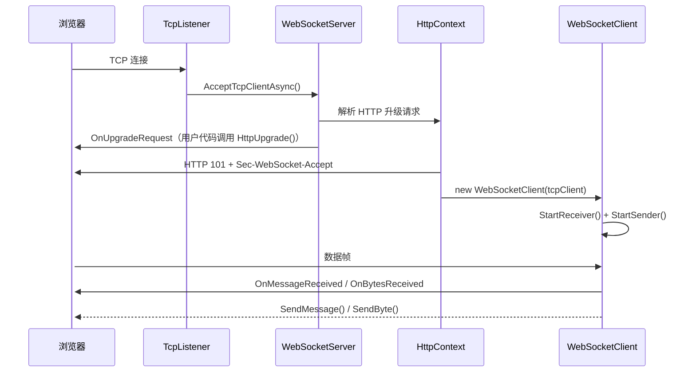

# LHZ.WebSocket.Server

[English](README.md)

一个轻量级、零依赖的 .NET WebSocket 服务端库，基于原生 `TcpListener` / `TcpClient` 从零实现 RFC 6455 协议。

## 项目结构

```
LHZ.WebSocket.Server/
├── LHZ.WebSocket.Server/              # 核心库
│   ├── WebSocketServer.cs             # TCP 监听器 & 客户端生命周期管理
│   ├── WebSocketClient.cs             # 单连接收发管理
│   ├── Core/
│   │   ├── CloseMessage.cs            # 关闭帧负载
│   │   ├── DataFrame.cs               # 数据帧构建 / 解析（RFC 6455 §5.2）
│   │   └── DataFrameReader.cs         # 从 Stream 读取并解析帧
│   ├── Enums/
│   │   ├── ClientStatus.cs            # 客户端生命周期状态
│   │   ├── CloseCode.cs               # RFC 6455 关闭状态码
│   │   ├── OpCode.cs                  # 帧操作码
│   │   └── ServerStatus.cs            # 服务端生命周期状态
│   └── Http/
│       ├── HttpContext.cs             # HTTP 升级握手
│       ├── HttpHeaders.cs             # 内部请求头集合
│       └── HttpRequest.cs             # HTTP 请求行 & 请求头解析
├── LHZ.WebSocket.TestConsole/         # Echo 服务端示例
│   └── Program.cs
└── test-client.html                   # 浏览器端测试客户端
```

## 功能特性

- **零依赖** — 纯 .NET 实现，不依赖任何第三方库
- **RFC 6455 完全兼容** — 支持 FIN、RSV1–3、全部操作码、掩码、扩展负载长度
- **分片消息** — 自动重组 Continuation 帧（客户端 → 服务端）
- **流式发送** — 通过 `CreateDataFrame(Stream)` 将大负载拆分到多个帧中发送
- **有界通道** — 出站帧采用生产者-消费者模式，无无界队列
- **事件驱动** — `OnMessageReceived`、`OnBytesReceived`、`OnCloseRecived`、`OnClientClose`
- **Ping/Pong 可扩展** — 虚方法 `PingProcessing` / `PongProcessing` 支持自定义心跳逻辑
- **.NET 10** — 目标框架为 `net10.0`，启用可空引用类型

## 快速开始

### 1. 添加项目引用

```xml
<ItemGroup>
    <ProjectReference Include="..\LHZ.WebSocket.Server\LHZ.WebSocket.Server.csproj" />
</ItemGroup>
```

### 2. 创建并启动服务端

```csharp
using LHZ.WebSocket.Server;
using LHZ.WebSocket.Server.Core;
using LHZ.WebSocket.Server.Http;

// 监听 5000 端口，绑定所有网络接口
var server = new WebSocketServer(5000);

server.OnUpgradeRequest += (HttpContext context) =>
{
    // 可选：检查请求头、添加自定义响应头、或拒绝升级
    // context.ResponseHeaders.Add("X-Custom", "value");

    var client = context.HttpUpgrade();    // 完成 101 握手

    client.OnMessageReceived += (WebSocketClient sender, string message) =>
    {
        Console.WriteLine($"收到消息: {message}");
        sender.SendMessage($"Echo: {message}");
    };

    client.OnBytesReceived += (WebSocketClient sender, byte[] data) =>
    {
        Console.WriteLine($"收到 {data.Length} 字节");
    };

    client.OnCloseRecived += (WebSocketClient sender, CloseMessage msg) =>
    {
        Console.WriteLine($"客户端关闭: {msg.CloseCode} — {msg.Message}");
        sender.Close();
    };
};

server.Start();
Console.WriteLine($"服务端已启动，当前连接数: {server.ClientNums}");
Console.ReadLine();
server.Stop();
```

### 3. 绑定指定 IP

```csharp
var server = new WebSocketServer(IPAddress.Loopback, 5000);
```

### 4. 运行示例

```bash
cd src/LHZ.WebSocket.TestConsole
dotnet run
```

然后在浏览器中打开 `test-client.html`，点击 **连接**，即可开始发送消息。

## API 参考

### `WebSocketServer`

| 成员 | 说明 |
|--------|-------------|
| `WebSocketServer(int port)` | 绑定所有网络接口的指定端口 |
| `WebSocketServer(IPAddress ip, int port)` | 绑定指定 IP 和端口 |
| `Start()` | 开始接受连接 |
| `Stop()` | 断开所有客户端并停止监听 |
| `ClientNums` | 当前已连接客户端数量 |
| `WebSocketClients` | 已连接客户端快照（数组副本） |
| `OnUpgradeRequest` | HTTP 升级请求到达时触发；调用 `HttpUpgrade()` 接受升级 |
| `OnClientConnected` | WebSocket 握手完成后触发 |

### `WebSocketClient`

| 成员 | 说明 |
|--------|-------------|
| `WebSocketClient(TcpClient tcp)` | 使用默认出站队列容量（1024）创建 |
| `WebSocketClient(TcpClient tcp, int capacity)` | 使用自定义队列容量创建 |
| `Status` | 当前 `ClientStatus`（Connection / Opend / Close） |
| `SendMessage(string)` | 发送 UTF-8 文本帧 |
| `SendByte(byte[])` | 发送二进制帧 |
| `Open()` | 启动后台收发循环 |
| `Close()` | 取消后台任务并释放 TCP 连接 |
| `OnMessageReceived` | `EventHandler<WebSocketClient, string>` — 完整文本消息 |
| `OnBytesReceived` | `EventHandler<WebSocketClient, byte[]>` — 完整二进制消息 |
| `OnCloseRecived` | `EventHandler<WebSocketClient, CloseMessage>` — 收到关闭帧 |
| `OnClientClose` | `Action<WebSocketClient>` — 连接关闭（本地或远端） |
| `PingProcessing(byte[])` | `virtual` — 重写以实现自定义 Ping 处理 |
| `PongProcessing(byte[])` | `virtual` — 重写以实现自定义 Pong 处理 |

### `HttpContext`

| 成员 | 说明 |
|--------|-------------|
| `Request` | 解析后的 HTTP 请求（方法、URL、请求头） |
| `ResponseHeaders` | 在 101 响应中发送的可变请求头集合 |
| `HttpUpgrade()` | 计算 `Sec-WebSocket-Accept`，写入 `101 Switching Protocols`，返回 `WebSocketClient` |
| `WebSocketClient` | 升级后的客户端（调用 `HttpUpgrade()` 后填充） |

### `HttpRequest`

| 成员 | 说明 |
|--------|-------------|
| `Method` | HTTP 方法（如 `GET`） |
| `Url` | 请求路径（如 `/chat`） |
| `HttpVersion` | HTTP 版本字符串（如 `HTTP/1.1`） |
| `Headers` | 解析后的请求头（键名不区分大小写） |

### `DataFrame`

| 成员 | 说明 |
|--------|-------------|
| `CreateDataFrame(OpCode, bool FIN, byte[]? key, byte[] data)` | 从字节数组构建单个帧 |
| `CreateDataFrame(OpCode, byte[]? key, Stream data, int maxLen)` | 将流拆分为多个帧 |
| `FIN` / `RSV1` / `RSV2` / `RSV3` | 帧控制标志位 |
| `Opcode` | `OpCode` 枚举值 |
| `Masked` | 负载是否经过 XOR 掩码处理 |
| `MaskingKey` | 4 字节掩码密钥（未掩码时为 null） |
| `DataFrameHeader` | 序列化后的帧头（2–14 字节） |
| `Data` | 负载数据 `ArraySegment<byte>` |

### `CloseMessage`

| 成员 | 说明 |
|--------|-------------|
| `CloseCode` | RFC 6455 状态码（如 `Normal = 1000`） |
| `Message` | 可选的可读关闭原因 |

### 枚举

**`OpCode`** — `Continuation (0x0)`、`Text (0x1)`、`Binary (0x2)`、`Close (0x8)`、`Ping (0x9)`、`Pong (0xA)`

**`CloseCode`** — 全部 RFC 6455 状态码：`Normal (1000)`、`GoingAway (1001)`、`ProtocolError (1002)`、…、`TlsHandshake (1015)`

**`ClientStatus`** — `Connection`、`Opend`、`Close`

**`ServerStatus`** — `Ready`、`Start`、`Closing`、`Closed`

## 架构



每个 `WebSocketClient` 内部运行两个后台任务：

- **Receiver（接收器）** — 通过 `DataFrameReader` 读取帧，重组分片消息，按操作码分发
- **Sender（发送器）** — 从有界 `Channel<DataFrame>` 中取出帧，将帧头 + 负载写入网络流

## 环境要求

- [.NET 10 SDK](https://dotnet.microsoft.com/download/dotnet/10.0)

## 许可证

[MIT](LICENSE)
